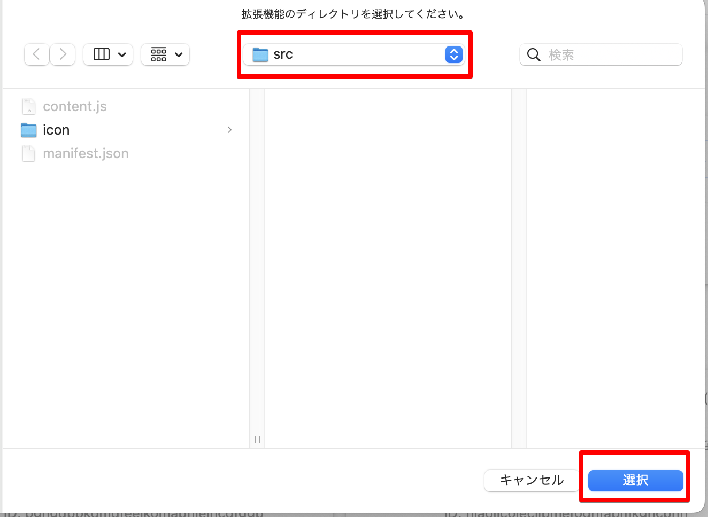

# Osyaburi

connpassイベントの参加者の中に、指定したユーザーが存在する場合Alertを表示してくれます。

指定したユーザーが存在する場合、このようにアラートが出てくれます。


## 由来

『家庭教師ヒットマンREBORN!』という漫画に登場するアイテムです。

[アルコバレーノ](https://dic.pixiv.net/a/%E3%82%A2%E3%83%AB%E3%82%B3%E3%83%90%E3%83%AC%E3%83%BC%E3%83%8E)という7人の赤ん坊が登場するのですが、彼ら同士が近づくと持っているおしゃぶりが光ります。

## 使い方

このリポジトリを`fork`し、ローカルへ`clone`します。

その後、`content.js`に通知対象としたいconnpassアカウントのユーザーIDを指定します。

```
const targetUserList = [
  "targetUserName", // 通知対象としたいユーザーの名前
];
```

あとは`src`フォルダをchrome拡張機能として読み込ませるだけです。


