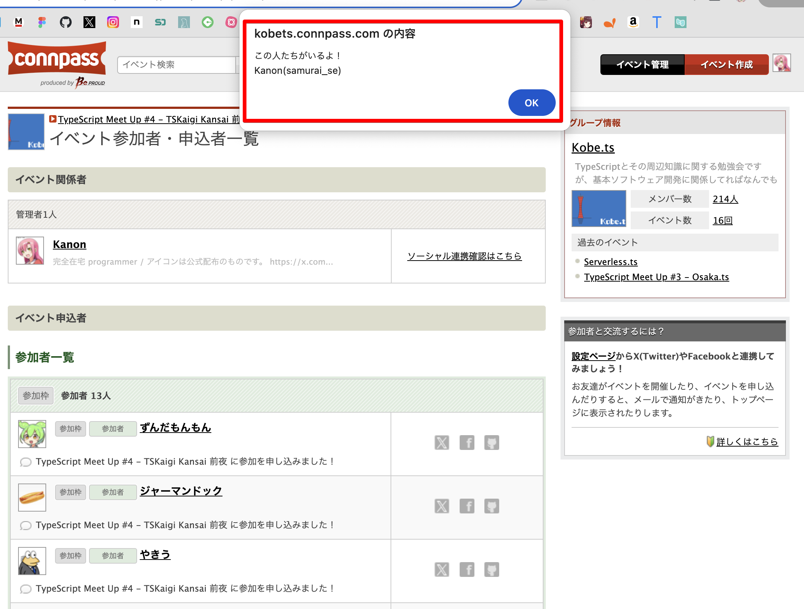

# Osyaburi

connpassイベントの参加者の中に、指定したユーザーが存在する場合Alertを表示してくれます。

## 由来

『家庭教師ヒットマンREBORN!』という漫画に登場するアイテムです。

[アルコバレーノ](https://dic.pixiv.net/a/%E3%82%A2%E3%83%AB%E3%82%B3%E3%83%90%E3%83%AC%E3%83%BC%E3%83%8E)という7人の赤ん坊が登場するのですが、彼ら同士が近づくと持っているおしゃぶりが光ります。

## 使い方

[chrome ウェブストア](https://chromewebstore.google.com/category/extensions?hl=ja)は公開審査中です。

公開されるまでは、GitHubからソースをcloneして`chrome://extensions/`から「パッケージ化されていない拡張機能を読み込む」を選んで`clone`したリポジトリの`src`フォルダを読み込ませて使ってみてください。

拡張機能をインストール後、アイコンをクリックして表示されるテキストエリアに、存在をお知らせしてほしいconnpassユーザーのIDを改行して入力します。

connpassユーザーIDはプロフィールページに`(xxx)`と表示されているものです。

入力後、保存ボタンを押せば準備OKです。

あとはconnpassのイベントページから、参加者一覧ページに移動した時に保存したユーザーがいた場合はこんな風にAlertでお知らせしてくれるようになります。

## アイコン素材

[こちら](https://illustcenter.com/2021/09/14/rdesign_1233/)のサイトの無料イラストを利用させていただきました！